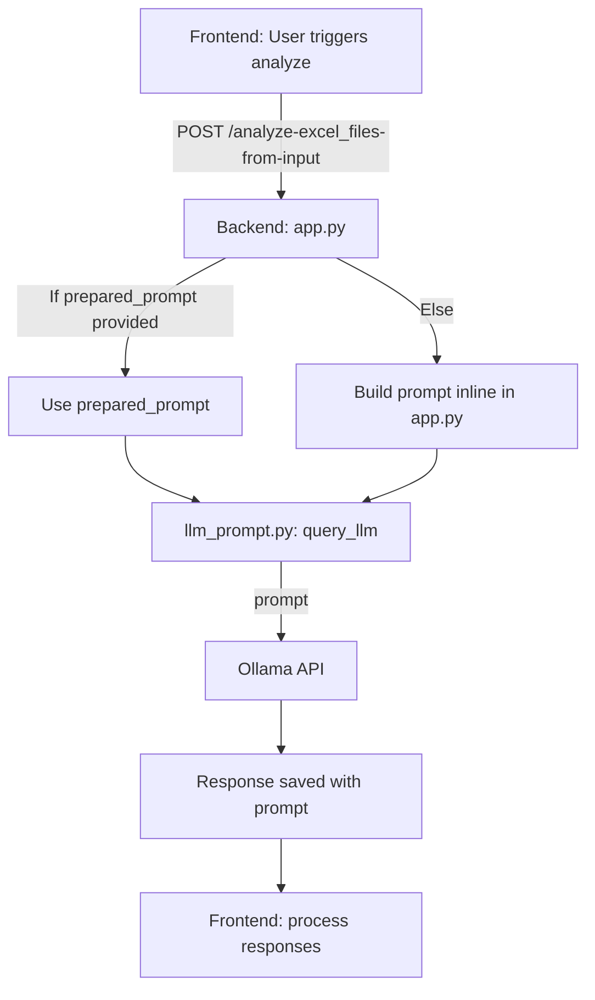

# Prompt Flow: Analyze to LLM (Agentic ETL)

This document explains how prompts are constructed and sent to the LLM, with clear steps and a simple diagram.

---

## Overview

- The prompt sent to Ollama is either:
  - Provided directly by the frontend as `prepared_prompt`, or
  - Built inline in the backend (app.py) if not provided.
- The prompt is always sent as the `prompt` field in the payload to Ollama.
- The prompt and LLM response are saved together for later review.

---

## Flow Diagram

---

## Step-by-Step

1. **Frontend (JS):**
   - User triggers analyze (file upload, button, etc).
   - JS builds a request with `prepared_prompt` (if available) and posts to `/analyze-excel_files-from-input`.

2. **Backend (app.py):**
   - Receives request and reads `prepared_prompt` from the body.
   - If present, uses it directly. If not, builds a prompt inline.
   - Calls `query_llm` in llm_prompt.py to send the prompt to the LLM.

3. **LLM Call (llm_prompt.py):**
   - `query_llm` builds a payload with the prompt and sends it to the Ollama API.
   - The response is saved together with the prompt for traceability.

---

## Key Points

- Prompts are always built in app.py (never from a template file).
- The prompt is sent as the `prompt` field in the Ollama payload.
- The prompt and response are always saved together for review.

---
