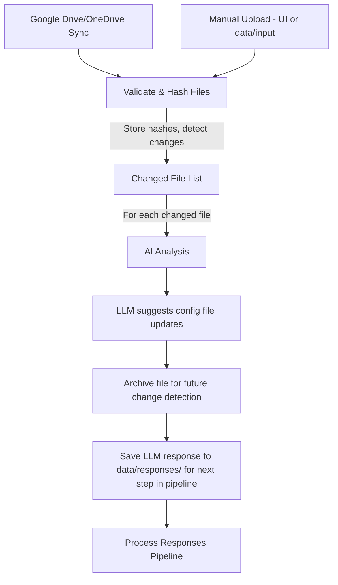
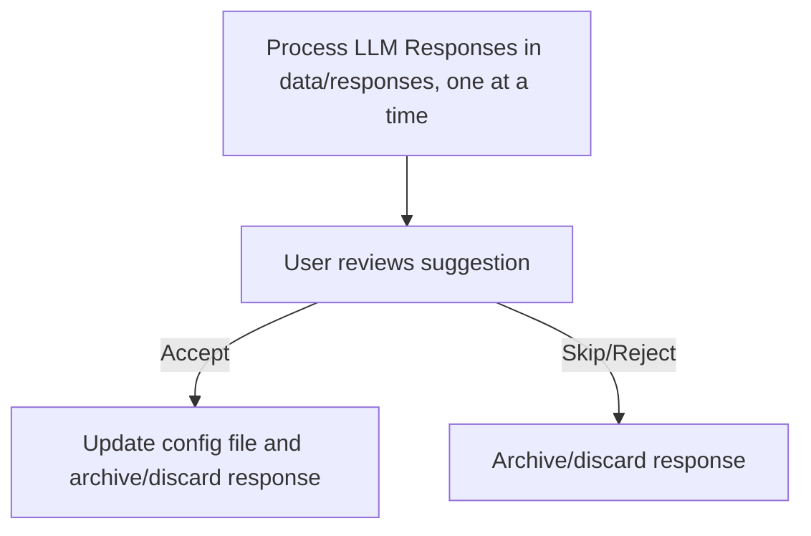

# Agentic End-to-End ETL Project

## Project Overview
- This project is focused on building an automated ETL (Extract, Transform, Load) system using AI.
- The system will take input files, detect when they change, and update Excel-based models automatically.

For a user-friendly, step-by-step guide to setting up the project, see the [Setup Guide](consumer-bundle/HELP_Guides/Agentic_ETL_Setup_Guide.html).

Once you get the tool up and running, you can access a detailed command usage guide directly in the web interface by clicking the **Command Usage Guide** button at the top.

This README focuses on technical and backend details. For frontend usage, **see the HTML guides above or within the tool itself**

## Key Features
- Change detection for input files (hash/eTag-based)
- AI-driven analysis and transformation
- Human-in-the-loop for ambiguous cases
- Modular: run full pipeline or individual steps
- Cross-platform: Windows & Mac

## Technologies
- Python, Docker, Local LLM (Ollama)

## Current Status
- Early-stage: core pipeline, Docker setup, and basic file processing are implemented
- See [DOCUMENTATION.md](DOCUMENTATION.md) for technical details

## High-Level Workflow



**Process Responses Pipeline:**


**Notes:**
- All processed files are archived after output for future change detection (change detection compares new uploads against the most recent archived version).
- The AI analysis step is designed to be non-destructive: it only suggests changes and saves them as response records. 
- The "Process Responses" step allows the user to review and selectively apply the AI's suggestions, ensuring human oversight for any modifications to the config file or data.

**See the [General Use Guide](consumer-bundle/HELP_Guides/General_Use_Guide.html) for a user-oriented workflow diagram and step-by-step instructions.**

## Usage (Backend Quick Start)

### Quick Start

This tool requires **Docker Desktop** and **Ollama** to be running in the background, plus a correctly configured **.env** file and Microsoft Azure registration (Google Drive + OneDrive + model settings). Check the [setup guide](consumer-bundle/HELP_Guides/Agentic_ETL_Setup_Guide.html) for detailed instructions on setting up these components.

The Microsoft Azure app registrations and .env file have already been set up for an account on the BGSU tenant, and if you have the .env file with the correct credentials, you should be able to run the tool immediately. If you want to set up your own Azure app registration and OneDrive, or if you want to change the AI model, follow the detailed instructions in the setup guide:


After setup, start backend services:

1. **Start Services**
   ```bash
   docker compose up --build -d
   ```
   Open http://localhost:8080 in your browser.

You may also do this step using the start button in the consumer bundle folder, which runs the above command and opens the web UI automatically.

2. **Use the Chat Interface**
   - Type: ** 0 or `help` ** → See all command options
   - Type: ** 1 or `run file processing`** → Detect changes in the input folder & prepare files for LLM analysis
   - Type: ** 2 or `run file syncing`** → Preform Full file sync: Google Drive -> OneDrive -> project input. (Requires authentication tokens for both) 
   - Type: ** 3 or `process responses`** → Process pending LLm response JSON files in data/responses (excluding archive file)
   - Type: ** 4 or `input`** → Upload a file into project input folder (data/input)
   
   ** One time commands for tool setup **
   - Type: ** 5 or `authenticate OneDrive`** → Start/continue a broswer-based OneDrive authentication process
   - Type: ** 6 or `complete OneDrive auth`** → Explicitly continue authentication after browser sign-in. Saves a token to the data/state folder, which is used for OneDrive file syncing
   - Type: ** 7 or `analyze - AI analysis`** → AI analysis: Upload input file + config file, analyze with Ollama
   - Type: ** 8 or `download from onedrive` ** → OneDrive download to project input (requires authentication)
   - Type: ** 9 or `run google to onedrive` ** → Sync files Google Drive -> OneDrive
   - Type: ** 10 or `cleanup`** →  Reset all generated states, Clear all outputs, hashes, and OneDrive manifest except files in the input folder

For a detailed walkthrough on what each command does, command workflows, ideal consumer workflow, and a data-flow diagram, click on the "Detailed Agentic ETL Specifiiations" button at the top of the chat interface.

For a detailed walkthrough of each feature, click the "Agentic ETL Command" button at the top of the chat interface. For full technical details on how the commands work, see [Agentic_ETL_Specification.md](Agentic_ETL_Specification.md).

**For detailed technical documentation, click the other button, "Agentic ETL Specifications"**

### Model Configuration

Set your preferred model in the `.env` file:
```bash
OLLAMA_MODEL_NAME=llama3.2:1b
```

The tool will automatically download and use the specified model from Ollama. Make sure the model name is correct. To save time, you may choose to pull the model manually using the following command:
```bash
ollama pull llama3.2:1b
```

**Note:** The first analysis may take longer as the model loads into memory.


## OneDrive Features (Backend)
- Change detection: Only downloads new/modified files (eTag/lastModifiedDateTime)
- No duplicates: Already-downloaded files are skipped
- File types: `.xlsx`, `.xls`, `.xlsm`, `.csv`
- Manifest log: Excel file tracks all downloads for auditing
- Interactive mode: Add `--interactive` to prompt before each download
- Folder targeting: Set `ONEDRIVE_REMOTE_FOLDER` in `.env` to sync specific folders


## Testing
Run all backend tests:
```bash
docker compose exec api pytest backend/src/tests
```
See [TESTING.md](TESTING.md) for more.


## Troubleshooting
For help with specific issues, see:
- Ollama/model issues: [LOCAL_OLLAMA_SETUP.md](LOCAL_OLLAMA_SETUP.md#troubleshooting)
- Docker/API errors: [DOCKER.md](DOCKER.md#troubleshooting)
- Benchmark issues: [benchmarks/README.md](benchmarks/README.md#troubleshooting)


## Directory Structure

- **data/input/**: Main input folder (cloud sync & UI uploads)
- **data/config/**: Config files for transformation rules
- **data/responses/**: Saved LLM response records for review
- **data/archive/**: Baseline/historical snapshots (copies of previous versions)for change detection
- **data/output/**: Files get moved here after file processing, then to archive after the workflow is complete. This folder is a buffer in the case the user cancels the workflow or an error occurs, so the archived (baseline) files and change detection are not affected.
- **data/state/**: Tool state (manifests, tokens, hashes)
- **backend/**: Python code, API, and tests
- **frontend/**: UI files (HTML, CSS, JS)
- **docker/**: Dockerfiles for the web UI and API
- **benchmarks/**: Model performance testing

> Folders are created automatically on first run. Set `BASELINE_HISTORY_MODE=all` to keep all snapshots, or `latest` to keep only the most recent.


